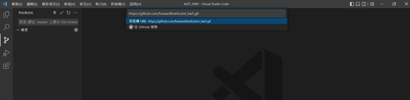
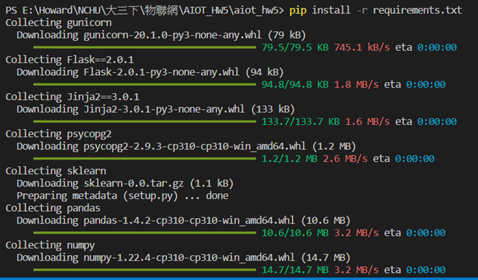
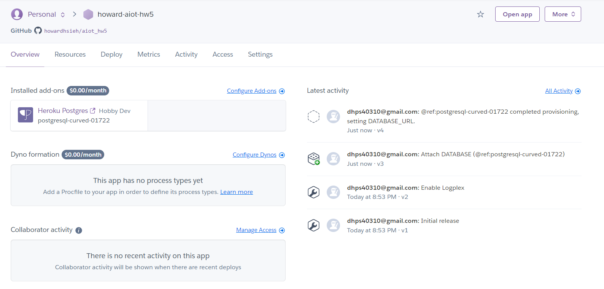
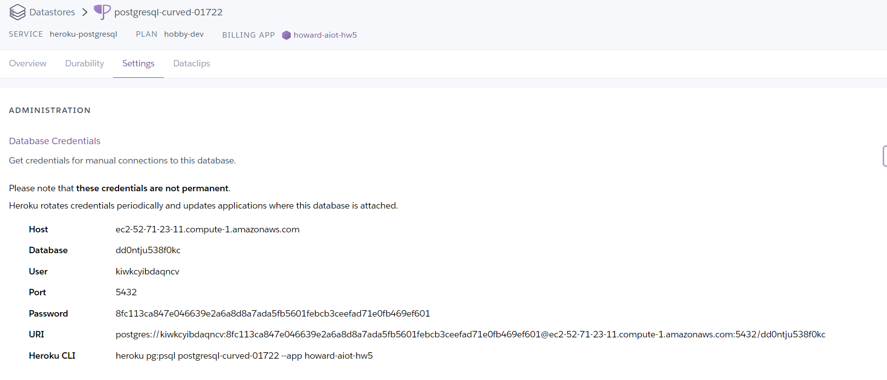
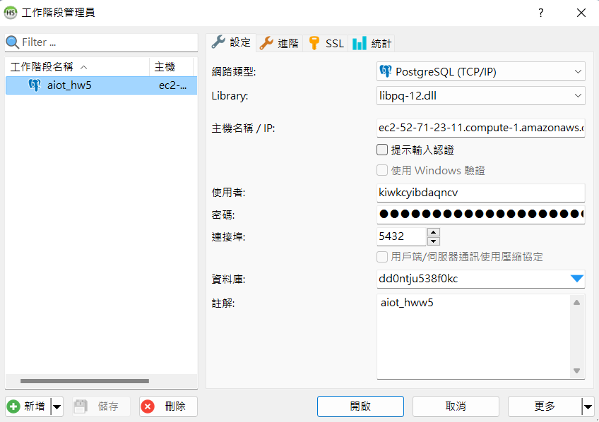
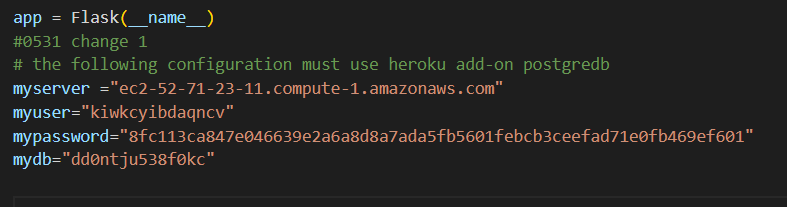
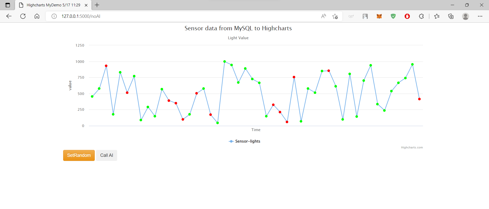
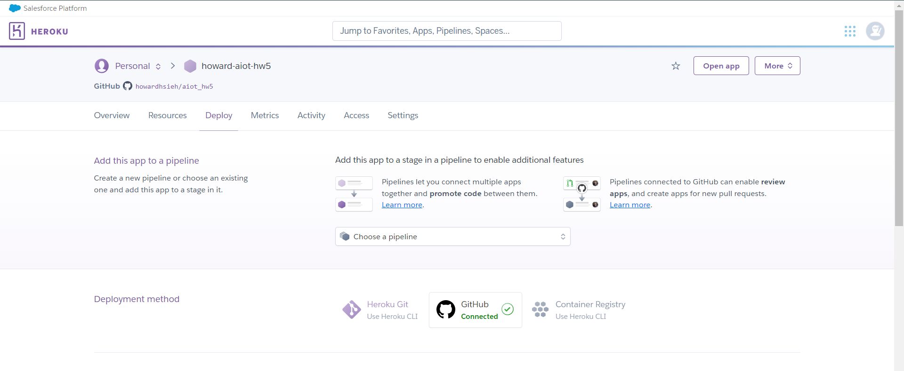
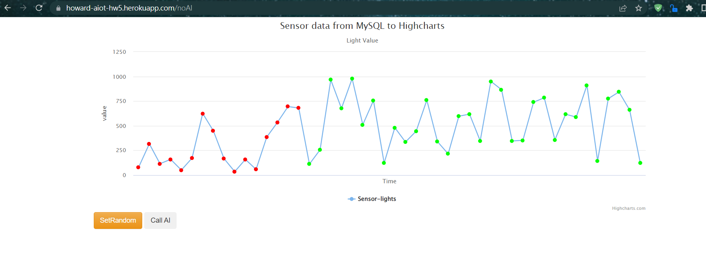
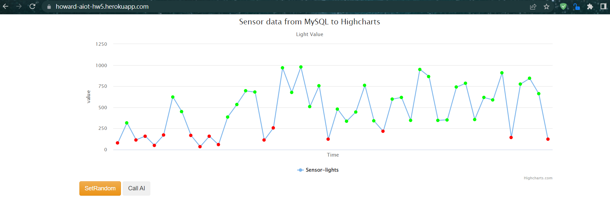

# AIoT Github

## Lecture 16: IoT Flask Web (deploy to heroku)
#### Author: Howard Hsieh

### step 0:
    * 註冊 Heroku, github 請下載 HeidiSQL, VS code

### step 1 : Clone this github
* git clone https://github.com/huanchen1107/aiot0530-start-no-token 到 local\aiot_hw5 folder
    * 推送至github 



### step 2 : install some package

* pip install -r requirements.txt




### step 3: add an heroku postgredb

* register heroku account
* go to dashboard
* new an app
* go to resource and add-on an Heroku postgredb



### step 4: login to heroku pstgredb using HeidiSQL

* 到 Postgresql / Settings / Database Credentials 取得資料庫資訊




### step 5: import postgredb (in db/postgre.db)



### step 6: setting db in app.py

```sql
myserver ="<fill-in-Heroku-Postgredb-DB-sever>"
myuser="<fill-in-Heroku-Postgredb-DB-user>"
mypassword="<fill-in-Heroku-Postgredb-DB-pwd>"
mydb="<fill-in-Heroku-Postgredb-DB-db>"

```



### step 7: testing locally by running python app.py



### step 8: deploy to github (new public github repositoy 不然看不到)

* git push origin master


### step 9: Heroku deploy from github



### step 10: Complete

* https://howard-aiot-hw5.herokuapp.com/

* random





